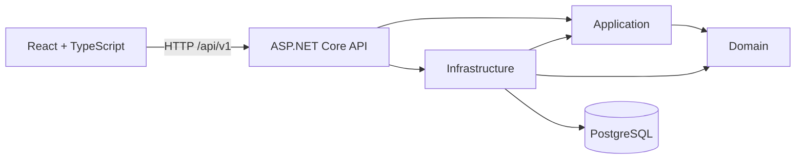
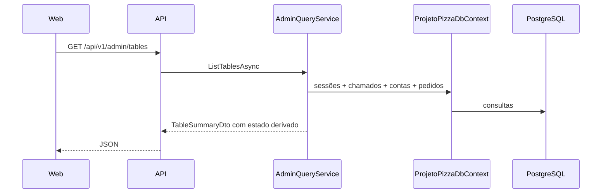

# Arquitetura

## Decisão

O ProjetoPizza inicia como um **monólito modular** em .NET 10. Essa forma mantém transações locais e operação simples, ao mesmo tempo em que explicita limites de negócio. Não há microsserviços, CQRS, event sourcing, MediatR, AutoMapper, Repository genérico ou Unit of Work adicional.

## Dependências

- `Domain`: regras, agregados, value objects e IDs fortes; zero dependência dos demais projetos.
- `Application`: casos de uso e portas necessárias; depende somente de Domain.
- `Infrastructure`: EF Core, Npgsql, Identity, migration e seed; implementa portas da Application.
- `Api`: composição, HTTP, autenticação/autorização, OpenAPI, health checks e Problem Details.
- `Web`: cliente HTTP; não referencia projetos .NET nem acessa o banco.

## Módulos

`Core`, `Identity`, `Catalog`, `Inventory`, `Dining`, `Ordering`, `Production`, `Billing`, `Cashier`, `Devices`, `Notifications` e `Audit` são namespaces/diretórios internos. Todos compartilham a mesma implantação e o mesmo PostgreSQL, mas cada um possui schema próprio.

## Fluxo administrativo

Comandos seguem a mesma direção: o endpoint autentica e extrai a identidade, o caso de uso coordena as consultas necessárias, o agregado valida a transição e o `DbContext` persiste a transação. Endpoints não alteram entidades diretamente.

## Fluxo do tablet da mesa

O Web ativa um dispositivo previamente provisionado e vinculado a uma mesa. A API encerra a sessão anterior do tablet, gera um token opaco aleatório e persiste somente seu hash SHA-256. Os endpoints dependem de portas específicas para sessão, consultas, pedidos e assistência; a implementação coordena o contexto do dispositivo e delega as transições aos agregados.

Preço e disponibilidade são sempre recalculados no servidor. O cliente envia apenas identificadores, quantidades e personalizações; valores exibidos no navegador nunca são aceitos como autoridade. O identificador criado pelo cliente para o pedido funciona como chave de idempotência e evita duplicação em tentativas repetidas.

## Decisões

- Um `ProjetoPizzaDbContext`, com schemas por módulo.
- IDs técnicos em UUID e tipos fortes no Domain.
- `Money` com `decimal`, BRL e arredondamento `ToEven`; persistido como `numeric(18,2)`.
- `DateTimeOffset` e timestamps PostgreSQL com fuso; datas criadas em UTC.
- Estado visual da mesa é uma projeção de `TableSession`, `ServiceCall` e `Bill`.
- Registros transacionais usam `DeleteBehavior.Restrict`; cascata permanece apenas nas tabelas internas do Identity.
- Concorrência otimista com `xmin` em agregados operacionais.
- Estratégias de preço de pizza implementam `IPizzaPricingPolicy` no Domain. A Application seleciona a política configurada e recebe um `Money` já calculado pelo domínio.
- Queries administrativas diretas e específicas; não há abstração de repositório genérico.
- Mocks do Web são centralizados, tipados e usados somente como fallback de desenvolvimento.
- Identity emite JWT local assinado, com roles e claims de permissão; políticas distintas protegem leitura e escrita administrativa/operacional.
- O frontend armazena apenas a sessão necessária e envia o bearer token pelo cliente HTTP centralizado.
- O cache assíncrono do Web é centralizado no TanStack Query; SignalR apenas sinaliza mudanças e não transporta regras de domínio.
- Formulários administrativos usam schemas Zod no limite da interface, sem duplicar invariantes cuja autoridade permanece no Domain/Application.
- Sessões de tablet usam tokens opacos com hash persistido, expiração, encerramento explícito e limite de ativação por IP.
- Pedidos do tablet obedecem ao estado da mesa e às configurações operacionais de caixa antes de criar tickets por estação.
- Ingredientes adicionais são configurados no agregado `Ingredient`; a Application resolve disponibilidade e preço do catálogo, valida o sabor de destino e persiste snapshots em `OrderItemModifier`. O Web calcula apenas uma prévia para interação.
- Números de pedido, ticket de cozinha e comanda são obtidos por `IOperationNumberGenerator`; a Infrastructure usa sequências PostgreSQL atômicas, sem `MAX + 1` em produção.
- O bootstrap entrega catálogo e estado uma vez; o polling subsequente consulta apenas sessão, pedidos e conta em `/api/v1/client/state`.

## Riscos

- Queries do dashboard ainda são adequadas ao volume inicial; métricas maiores podem exigir projeções específicas.
- A assinatura JWT local atende desenvolvimento e implantação simples; produção deve usar uma chave em cofre ou um provedor de identidade externo.
- O primeiro seed é voltado ao desenvolvimento, não a dados mestres de produção.
- Impressão, adquirência de pagamentos e backup físico continuam dependentes de provedores externos.

## Decisões pendentes

- Provedor de identidade definitivo e ciclo de rotação das chaves.
- Política de preço padrão após validação com o negócio.
- Estratégia de imagens de produtos e armazenamento.
- Integração com TEF/Pix, impressoras e notificações.
- Requisitos de retenção e anonimização da auditoria.
