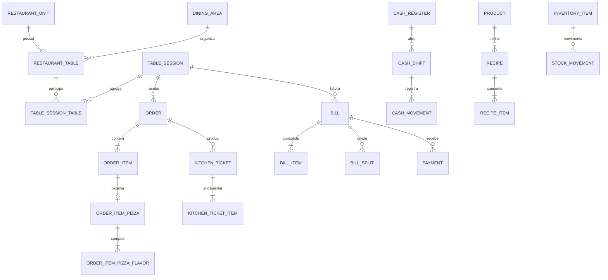

# Modelo de banco de dados

## Visão geral

O PostgreSQL é compartilhado por todo o monólito, com um único `ProjetoPizzaDbContext`. Os limites dos módulos são preservados por schemas. Chaves primárias de negócio usam `uuid`; valores monetários usam `numeric(18,2)` e timestamps usam `timestamp with time zone`.

| Schema | Responsabilidade | Tabelas principais |
| --- | --- | --- |
| `core` | Unidade e configurações | `restaurant_units`, `operation_settings`, `pizza_settings` |
| `identity` | Usuários, papéis e colaboradores | `users`, `roles`, tabelas auxiliares do Identity, `employees` |
| `catalog` | Cardápio e composição de pizza | `categories`, `products`, `product_variants`, `product_images`, `pizza_sizes`, `pizza_flavors`, `pizza_flavor_prices`, `pizza_crusts`, `pizza_crust_prices`, `ingredients`, `pizza_flavor_ingredients` |
| `inventory` | Estoque e fichas técnicas | `inventory_items`, `stock_balances`, `stock_movements`, `recipes`, `recipe_items` |
| `dining` | Salão, mesas e atendimento | `dining_areas`, `restaurant_tables`, `table_sessions`, `table_session_tables`, `waiter_assignments`, `service_call_types`, `service_calls` |
| `ordering` | Pedido e itens | `orders`, `order_items`, `order_item_pizzas`, `order_item_pizza_flavors`, `order_item_modifiers` |
| `production` | Produção da cozinha | `production_stations`, `kitchen_tickets`, `kitchen_ticket_items` |
| `billing` | Conta, divisão e pagamento | `bills`, `bill_items`, `bill_splits`, `bill_split_items`, `payment_methods`, `payments` |
| `cashier` | Caixa | `cash_registers`, `cash_shifts`, `cash_movements` |
| `devices` | Terminais e sessões | `devices`, `device_sessions` |
| `notifications` | Notificações internas | `notifications` |
| `audit` | Rastro de alterações | `audit_logs` |

## Relações centrais



Uma mesa não armazena o estado visual `Livre`, `Ocupada`, `Chamando`, `Conta solicitada` ou `Pagamento pendente`. A projeção é calculada com a sessão ativa, chamados pendentes e situação da conta, evitando estados duplicados e contraditórios.

## Integridade e concorrência

- FKs transacionais usam `Restrict`; exclusões em cascata ficam limitadas às tabelas internas do ASP.NET Core Identity.
- Índices únicos protegem identificadores como unidade/código, unidade/SKU, unidade/número do pedido e tamanho/sabor.
- Índices compostos cobrem as leituras operacionais por unidade, estado e data.
- Agregados operacionais usam a coluna de sistema PostgreSQL `xmin` como token de concorrência otimista.
- A Application impõe regras que dependem de leitura, como impedir associação simultânea de uma mesa a duas sessões abertas; o banco preserva a estrutura e o caso de uso coordena a transação.
- O campo `table_session_tables.unlinked_at` mantém o histórico de agrupamento e desagrupamento de mesas.

## Migration inicial

A migration `InitialCreate` e seu snapshot ficam em `src/ProjetoPizza.Infrastructure/Persistence/Migrations`. Para recriar um banco local:

```powershell
dotnet tool restore
dotnet run --project src/ProjetoPizza.Api -- --migrate
```

Para aplicar a migration e carregar dados de demonstração idempotentes:

```powershell
dotnet run --project src/ProjetoPizza.Api -- --seed
```

O seed é exclusivo para desenvolvimento e utiliza identificadores fixos. Ele inclui unidade, configurações, categorias, produtos, pizzas, estoque, 32 mesas, estações, formas de pagamento, dispositivos e amostras operacionais identificadas com `[DEV]`.

