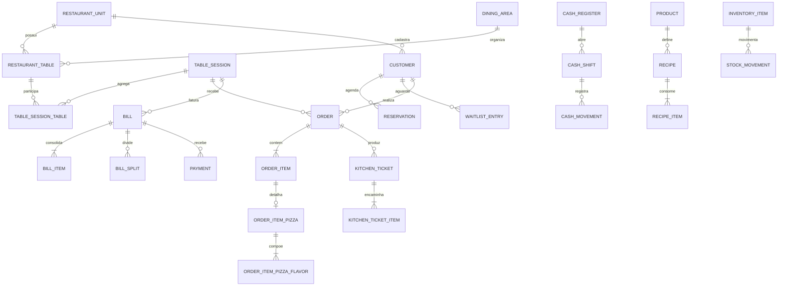

# Modelo de banco de dados

## Visão geral

O PostgreSQL é compartilhado por todo o monólito, com um único `ProjetoPizzaDbContext`. Os limites dos módulos são preservados por schemas. Chaves primárias de negócio usam `uuid`; valores monetários usam `numeric(18,2)` e timestamps usam `timestamp with time zone`.

| Schema | Responsabilidade | Tabelas principais |
| --- | --- | --- |
| `core` | Unidade e configurações | `restaurant_units`, `operation_settings`, `pizza_settings` |
| `identity` | Usuários, papéis e colaboradores | `users`, `roles`, tabelas auxiliares do Identity, `employees` |
| `customers` | Cadastro de clientes | `customers` |
| `catalog` | Cardápio e composição de pizza | `categories`, `products`, `product_variants`, `product_images`, `pizza_sizes`, `pizza_flavors`, `pizza_flavor_prices`, `pizza_crusts`, `pizza_crust_prices`, `ingredients`, `pizza_flavor_ingredients` |
| `inventory` | Estoque e fichas técnicas | `inventory_items`, `stock_balances`, `stock_movements`, `recipes`, `recipe_items` |
| `dining` | Salão, mesas e atendimento | `dining_areas`, `restaurant_tables`, `table_sessions`, `table_session_tables`, `waiter_assignments`, `reservations`, `waitlist_entries`, `service_call_types`, `service_calls` |
| `ordering` | Pedido e itens | `orders`, `order_items`, `order_item_pizzas`, `order_item_pizza_flavors`, `order_item_modifiers` |
| `production` | Produção da cozinha | `production_stations`, `kitchen_tickets`, `kitchen_ticket_items` |
| `billing` | Conta, divisão e pagamento | `bills`, `bill_items`, `bill_splits`, `bill_split_items`, `payment_methods`, `payments` |
| `cashier` | Caixa | `cash_registers`, `cash_shifts`, `cash_movements` |
| `devices` | Terminais e sessões | `devices`, `device_sessions` |
| `notifications` | Notificações internas | `notifications` |
| `audit` | Rastro de alterações | `audit_logs` |

## Relações centrais



Uma mesa não armazena o estado visual `Livre`, `Ocupada`, `Chamando`, `Conta solicitada` ou `Pagamento pendente`. A projeção é calculada com a sessão ativa, chamados pendentes e situação da conta, evitando estados duplicados e contraditórios.

## Integridade e concorrência

- FKs transacionais usam `Restrict`; exclusões em cascata ficam limitadas às tabelas internas do ASP.NET Core Identity.
- Índices únicos protegem identificadores como unidade/código, unidade/SKU, unidade/número do pedido e tamanho/sabor.
- Índices compostos cobrem as leituras operacionais por unidade, estado e data.
- `device_sessions.session_token_hash` possui índice único; `table_session_id` e `expires_at` são opcionais para permitir a credencial persistente no estado de espera. A consulta de acesso ativo continua coberta por dispositivo, `ended_at` e `expires_at`, e o token em texto puro não é persistido.
- `dining.table_sessions.opened_by_device_id` e `dining.table_session_tables.linked_by_device_id` registram comandas iniciadas pelo tablet. As colunas equivalentes de funcionário tornam-se opcionais, mas o Domain exige exatamente um ator de abertura/vínculo.
- `catalog.pizza_crust_prices` mantém, por tamanho, o valor da borda inteira (`additional_price`) e de uma meia borda (`half_additional_price`).
- `ordering.order_item_pizzas` preserva o modo da borda (`None`, `Whole` ou `Split`) e os snapshots das duas metades, garantindo que pedidos antigos não mudem quando o catálogo for alterado.
- `customers.customers` normaliza telefone e mantém `loyalty_points`, `lifetime_spend`, `order_count` e `last_order_at` para a fidelidade transacional.
- `dining.reservations` e `dining.waitlist_entries` preservam contato, quantidade, horários/previsões, estado e vínculo opcional com cliente. No fluxo administrativo de nova reserva, um cadastro existente é vinculado ou um novo cliente é criado na mesma transação da reserva. Índices por unidade, estado e data atendem a agenda operacional.
- `inventory.inventory_items.unit_cost` armazena o custo corrente. Movimentos de consumo preservam o custo em snapshot e o item do pedido, permitindo CMV histórico mesmo após alteração de preço.
- `billing.payments` mantém valor estornado, data e motivo sem apagar o recebimento original.
- `ordering.orders.customer_id` referencia o cadastro, enquanto `customer_name_snapshot` e `delivery_address_snapshot` preservam os dados operacionais do pedido mesmo após uma edição do cliente.
- Agregados operacionais usam a coluna de sistema PostgreSQL `xmin` como token de concorrência otimista.
- A Application impõe regras que dependem de leitura, como impedir associação simultânea de uma mesa a duas sessões abertas; o banco preserva a estrutura e o caso de uso coordena a transação.
- `cash_shifts.active_slot` é uma coluna calculada: vale `1` apenas para estados `Open` ou `Closing`. O índice único `ix_cash_shifts_single_active` impede duas aberturas simultâneas, inclusive em concorrência entre requisições.
- O campo `table_session_tables.unlinked_at` mantém o histórico de agrupamento e desagrupamento de mesas.
- `billing.bills.requested_split_count` preserva a quantidade de pessoas solicitada pelo tablet, com a regra de 2 a 50 no agregado.
- `catalog.ingredients` define `is_available_as_extra`, `extra_price` e `max_extra_quantity`. O pedido referencia o ingrediente, mas também preserva nome e preço em `ordering.order_item_modifiers`.
- `catalog.pizza_flavor_extras` vincula os adicionais permitidos a cada sabor, com preço, limite e disponibilidade próprios; sua chave composta impede vínculos duplicados.
- `catalog.product_extras` mantém a lista específica de complementos de cada produto do tipo pizza. `catalog.products.uses_custom_extras` diferencia uma lista explicitamente vazia da herança dos complementos configurados por sabor.
- `devices.device_provisionings` guarda somente o hash da credencial temporária, expiração, consumo e revogação. O índice único do hash impede duplicidade e o texto puro só existe na resposta de criação.
- As sequências `ordering.order_number_sequence`, `production.kitchen_ticket_number_sequence` e `dining.table_session_number_sequence` geram números operacionais sem colisão entre requisições concorrentes.

## Migrations

As migrations mais recentes são `AddRefundControls`, `AddInventoryRecipeCosts` e `AddCustomerLoyaltyReservations`; todas ficam com o snapshot em `src/ProjetoPizza.Infrastructure/Persistence/Migrations`. Para recriar um banco local:

```powershell
dotnet tool restore
dotnet run --project src/ProjetoPizza.Api -- --migrate
```

Para aplicar a migration e carregar dados de demonstração idempotentes:

```powershell
dotnet run --project src/ProjetoPizza.Api -- --seed
```

O seed é exclusivo para desenvolvimento e utiliza identificadores fixos. Ele inclui unidade, configurações, clientes, categorias, produtos, pizzas, ingredientes adicionais com preço, estoque, 32 mesas, estações, formas de pagamento, dispositivos e amostras operacionais identificadas com `[DEV]`.
