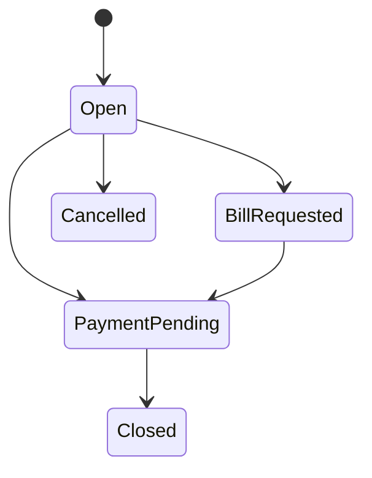
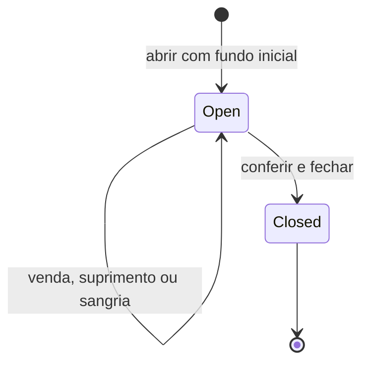

# Modelo de domínio

## Shared Kernel

- `Entity<TId>` e `AggregateRoot<TId>` fornecem identidade, sem infraestrutura.
- `Money` aceita somente valores não negativos, usa BRL inicialmente, arredonda em duas casas e impede operações entre moedas distintas.
- `Percentage` aceita valores de 0 a 100.
- `DomainException` e `BusinessRuleException` representam violações esperadas.

## Agregados e invariantes

- Core: `RestaurantUnit`, `OperationSettings`, `PizzaSettings`.
- Identity: `Employee`, desacoplado de `IdentityUser`.
- Customers: `Customer`, perfil e fidelidade reutilizáveis por unidade.
- Catalog: `Category`, `Product`, `PizzaSize`, `PizzaFlavor`, `PizzaCrust`, `Ingredient` e preços/composições.
- Inventory: `InventoryItem`, `StockBalance`, `StockMovement`, `Recipe`.
- Dining: `RestaurantTable`, `TableSession`, `Reservation`, `WaitlistEntry`, `ServiceCall`.
- Ordering: `Order`, `OrderItem` e composição normalizada da pizza.
- Production: `ProductionStation`, `KitchenTicket`.
- Billing: `Bill`, divisões, `PaymentMethod`, `Payment`.
- Cashier: `CashRegister`, `CashShift`, `CashMovement`.
- Devices: `Device`, `DeviceSession`.
- Cross-cutting: `Notification` e `AuditLog`.

### Pizzas

`PizzaSize` define o limite de 1 a 3 sabores. `OrderItemPizza` contém uma coleção de `OrderItemPizzaFlavor`, valida repetição, limite, partes e correspondência de `FlavorCount`. Não existem colunas `Flavor1Id`, `Flavor2Id` ou `Flavor3Id`. Nomes e preços são snapshots do momento do pedido.

### Mesas

Uma mesa inativa não inicia atendimento. `TableSession.Open` e `TableSession.OpenFromDevice` exigem pelo menos uma mesa e clientes maiores que zero. Junções e transferências usam `TableSessionTable`, encerram o vínculo anterior sem apagar histórico e impedem que o destino pertença a outra sessão ativa. O garçom principal pode ser reatribuído a um funcionário ativo da mesma unidade.

`Reservation` impede horários passados e transições fora do ciclo pendente, confirmado, recepcionado e concluído. `WaitlistEntry` controla espera, aviso, acomodação e cancelamento. Registros finalizados são imutáveis.

### Dispositivos

`DeviceSession` representa a credencial persistente do aparelho, não a sessão do cliente na mesa. Ela pode ficar sem `TableSessionId` enquanto o tablet está em espera e ser vinculada a uma nova comanda quando o cliente informa a quantidade de pessoas. O acesso termina somente por logout, bloqueio, desvínculo, troca de mesa ou reprovisionamento; concluir uma comanda limpa apenas seu vínculo com a `TableSession`.

### Pedidos e cozinha

Pedidos nascem em `Draft`; itens só são alterados nessa fase. Submeter exige item. Retirada e entrega exigem um cliente ativo; entrega também exige o snapshot do endereço. O nome do cliente permanece no pedido para preservar seu histórico. Taxa de entrega e desconto participam do total, e o desconto nunca pode superar o valor bruto. O ciclo segue `Submitted -> Accepted -> InProduction -> Ready -> Completed`. Cancelamento bloqueia novas alterações. Tickets de cozinha separam a produção por estação.

### Clientes

`Customer` pertence a uma unidade, exige nome, telefone com 8 a 15 dígitos e data de nascimento válida de até 120 anos. A situação ativa controla novos pedidos. Pedidos administrativos válidos acumulam um ponto por real inteiro, valor vitalício e contagem; o cancelamento reverte os três indicadores sem permitir valores negativos.

### Pagamentos

Pagamento deve ser maior que zero. Valor recebido não pode ser menor que o valor pago. Troco só é aceito quando `PaymentMethod.AllowsChange`; referência externa é obrigatória quando configurada. Estornos parciais ou totais acumulam valor, motivo e data, reabrem conta/sessão quando necessário e geram saída no caixa para dinheiro.

### Estoque e fichas técnicas

`InventoryItem.UnitCost` alimenta CMV e valor do estoque. `Recipe` define rendimento e ingredientes para produto ou sabor/tamanho. No envio, todas as quantidades são planejadas e validadas antes da baixa; falta de saldo rejeita o pedido inteiro. Cada `StockMovement` de consumo aponta para o `OrderItem` responsável.

A divisão por pessoas é persistida em `BillSplit`. Cada parte mantém nome, sequência, total, valor pago, saldo e estado próprios, e cada `Payment` referencia a pessoa correspondente. O caso de uso `POST /api/v1/admin/payments/split` valida de 2 a 50 pessoas, exige que a soma em centavos corresponda ao saldo da conta e grava todas as partes e pagamentos em uma única unidade atômica.

### Caixa

`CashShift` nasce aberto para um `CashRegister` ativo, com o colaborador autenticado como operador e fundo inicial não negativo. A Application impede uma nova abertura enquanto existir turno `Open` ou `Closing`, e a persistência repete essa proteção para requisições concorrentes. Toda abertura gera auditoria.

Movimentos são registrados somente durante um turno aberto e recalculam o valor esperado. O fechamento registra operador, valor contado, observação e diferença assinada entre valor contado e esperado, impedindo um segundo fechamento.

