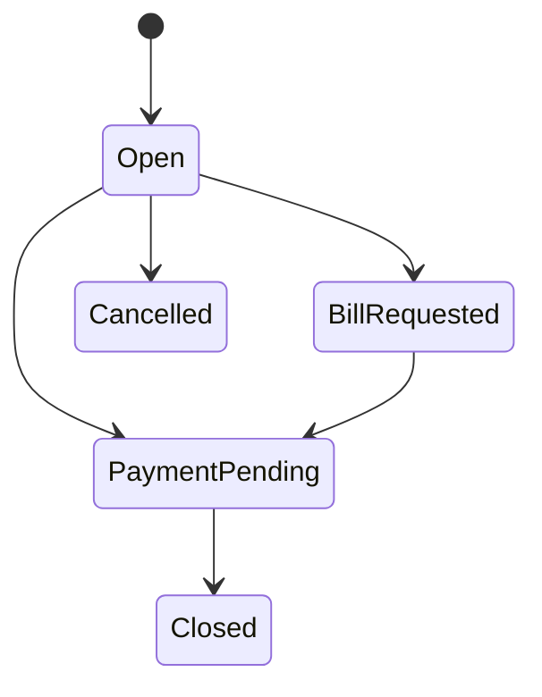

# Modelo de domínio

## Shared Kernel

- `Entity<TId>` e `AggregateRoot<TId>` fornecem identidade, sem infraestrutura.
- `Money` aceita somente valores não negativos, usa BRL inicialmente, arredonda em duas casas e impede operações entre moedas distintas.
- `Percentage` aceita valores de 0 a 100.
- `DomainException` e `BusinessRuleException` representam violações esperadas.

## Agregados e invariantes

- Core: `RestaurantUnit`, `OperationSettings`, `PizzaSettings`.
- Identity: `Employee`, desacoplado de `IdentityUser`.
- Catalog: `Category`, `Product`, `PizzaSize`, `PizzaFlavor`, `PizzaCrust`, `Ingredient` e preços/composições.
- Inventory: `InventoryItem`, `StockBalance`, `StockMovement`, `Recipe`.
- Dining: `RestaurantTable`, `TableSession`, `ServiceCall`.
- Ordering: `Order`, `OrderItem` e composição normalizada da pizza.
- Production: `ProductionStation`, `KitchenTicket`.
- Billing: `Bill`, divisões, `PaymentMethod`, `Payment`.
- Cashier: `CashRegister`, `CashShift`, `CashMovement`.
- Devices: `Device`, `DeviceSession`.
- Cross-cutting: `Notification` e `AuditLog`.

### Pizzas

`PizzaSize` define o limite de 1 a 3 sabores. `OrderItemPizza` contém uma coleção de `OrderItemPizzaFlavor`, valida repetição, limite, partes e correspondência de `FlavorCount`. Não existem colunas `Flavor1Id`, `Flavor2Id` ou `Flavor3Id`. Nomes e preços são snapshots do momento do pedido.

### Mesas

Uma mesa inativa não inicia atendimento. `TableSession.Open` exige pelo menos uma mesa e clientes maiores que zero. Junções usam `TableSessionTable`. Uma sessão fechada ou cancelada não recebe novos pedidos. A exclusividade de mesa ativa é também verificada na Application/persistência ao criar novos casos de uso de abertura.

### Pedidos e cozinha

Pedidos nascem em `Draft`; itens só são alterados nessa fase. Submeter exige item. O ciclo segue `Submitted -> Accepted -> InProduction -> Ready -> Completed`. Cancelamento bloqueia novas alterações. Tickets de cozinha separam a produção por estação.

### Pagamentos

Pagamento deve ser maior que zero. Valor recebido não pode ser menor que o valor pago. Troco só é aceito quando `PaymentMethod.AllowsChange`; referência externa é obrigatória quando configurada. Cancelamentos são estados, nunca exclusão física.

### Caixa

`CashShift` nasce aberto, registra movimentos somente nesse estado e calcula o valor esperado. O fechamento calcula a diferença assinada entre valor contado e esperado e impede novo fechamento.
